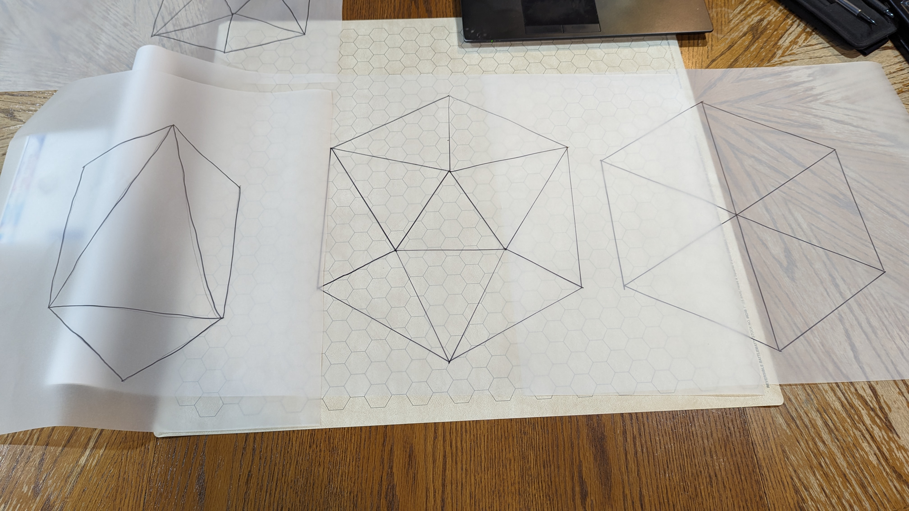
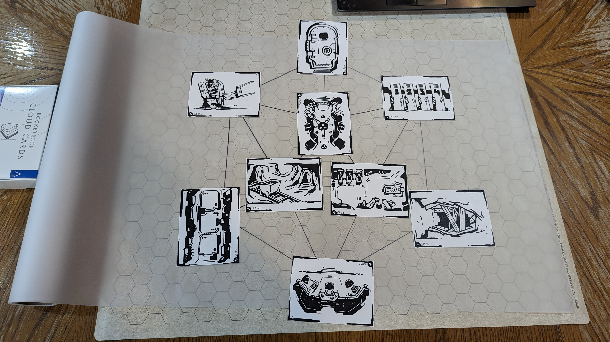
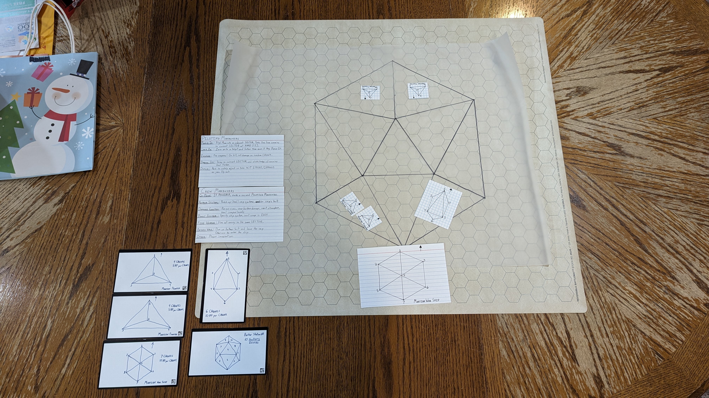
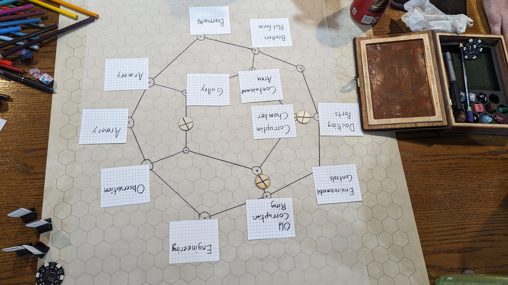

## Overview

This is an attempt to explain how I'm using "polyhedral frames" as I've been
calling them to prepare adventure locations, battle maps, and space sectors
and what not. This is not an original concept, but I took the "Site Preparation"
from [Mythic Bastionland](https://bit.ly/mbplaytest) and expand upon it a bit to
give more variation and feel for various locations. In Mythic Bastionland, Chris
shows how to use a "Hex" to build a Site, or anything to be explored. This to me
stood out as a d6 on its side showing the point at you. So, I decided to use
other role-playing dice polyhedrals. You'll see the frames further down.

## What is Polyhedral Prep?

I use the term: Polyhedral Prep, because I saw RPG Dice called Polyhedrals, so
it stuck. After having these frames I didn't know what to do next with them. It
wasn't until reading Mythic Bastionland and Electric Bastionland that I came to
the conclusion I could use these as a sort of "dungeon madlib" by giving each
vertex a location and each connection or line an encounter; very much like
Electric Bastionland Boroughs. So, I numbered each vertex and line/connection.

## How do I use this method?

For this example, we'll be defining a small Site, or dungeon using the d6 frame.
Using the guidelines from Mythic Bastionland, we define an entrance and a couple
open pathways, one or two closed paths and a secret path. Each vertex then gets
a keyword pair. You'll want to use an Oracle Descriptor Table like the ones
found in Mythic Game Master Emulator Second Edition or Ironsworn Starforged
(Ironsworn doesn't have a description oracle). Locations get descriptors that
fit within the context of the site. So if it is a dungeon and we roll something
like: Haunted/Outpost, it seems pretty inspiring so far. Haunted, maybe this
dungeon is loaded full of spirits. Outpost in a dungeon, that could be a lookout
room or tower. Maybe this is a fort full of spirits of soldiers that man the
ramparts. Bam, we have our first location in the site. Now we repeat the process
for each vertex staying within context. Make sure to use your other previous
locations in the site to inform how you interpret and make the rest of the
locations.

Let's do a connection or encounter. For this we'll want an action site as we
need to interact with the PCs instead of them interacting with the location.
Think active versus passive. So, we'll roll: Seize/Superstition. My first
thought is to think of how I can make this an active encounter to engage the PC.
How do I seize? Could be a grab trap, could be someone trying to steal my soul,
or something. We could also do seize of breath because of fear. Maybe, when the
PCs go down connection/encounter (1), they see an apparition of the boss spirit
of the Site, quick all PCs make a WIS Save! Any that fail, then have
disadvantage on checks and must make the check again when facing the BBEG later
one. Bam.

I then repeat this process for each location (vertex) and each encounter
(connection). Make sure you spread out a few locations with loot or lore as well
and not just encounters. Something else I do is add an NPC per location if it's
a populated location that isn't immediately hostile for the PCs to talk to. If
it's a hostile Site, just key the room as you would a traditional dungeon.

## An example!

This is an example from a game I ran a while ago where the players were
investigating an asteroid mining station looking for a missing individual.

